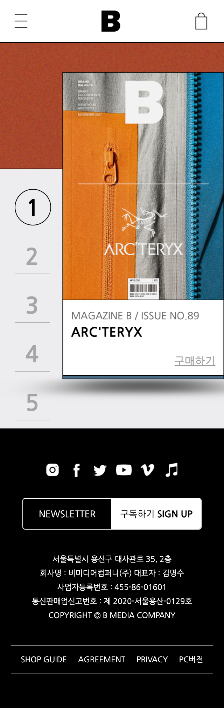

# publising_magazine-b
매거진 B 모바일 웹 리디자인 (메인 페이지 + 서브 페이지)

웹사이트 https://aewols.github.io/publising_magazine-b/

 

## 이미지

 

## 소개
### About 매거진 B

광고 없이 한 호에 하나의 브랜드만을 다루는 잡지 매거진 <B>는 2011년 11월
 창간 이래로 세계의 균형잡힌 브랜드를 선정해 소개해왔습니다.
 브랜드에 관심 있는 사람부터 마케팅, 브랜딩 등 크리에이티브 관령 업에
 종사하는 이들까지 두루두루 읽을 수 있는 잡지입니다.

 

## 수행 내용
### 모바일 웹 전체 페이지 제작 - HTML, CSS, jQuery를 이용한 UI 구현

* 레이아웃은 HTML5 시멘틱 태그로 구성
* 전체 화면 fullpage로 구성
* 가변 그리드, 가변 마진, 가변 패딩, 가변 이미지, 가변 폰트 사용 
* jQuery를 활용한 모바일 메뉴 내 애미메이션 효과 구현
* jQuery를 활용한 각 페이지 콘텐츠에 맞춘 스크롤 효과 구현
* jQuery를 활용한 탭 메뉴, 아코디언 메뉴 활용
* 이미지 또는 배너는 마우스 오버시 효과를 트렌지션 효과를 사용하여 구현
* 접근성과 편리성을 위한 웹 표준 준수
* 주요 브라우저에서 레이아웃이 호환 가능(크로스브라우징)
